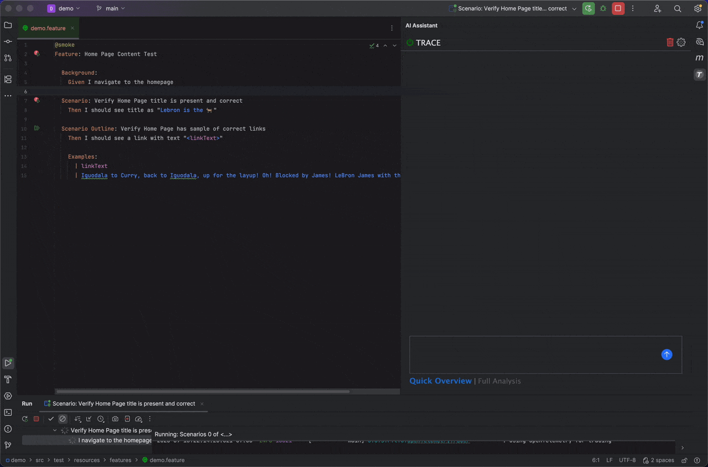
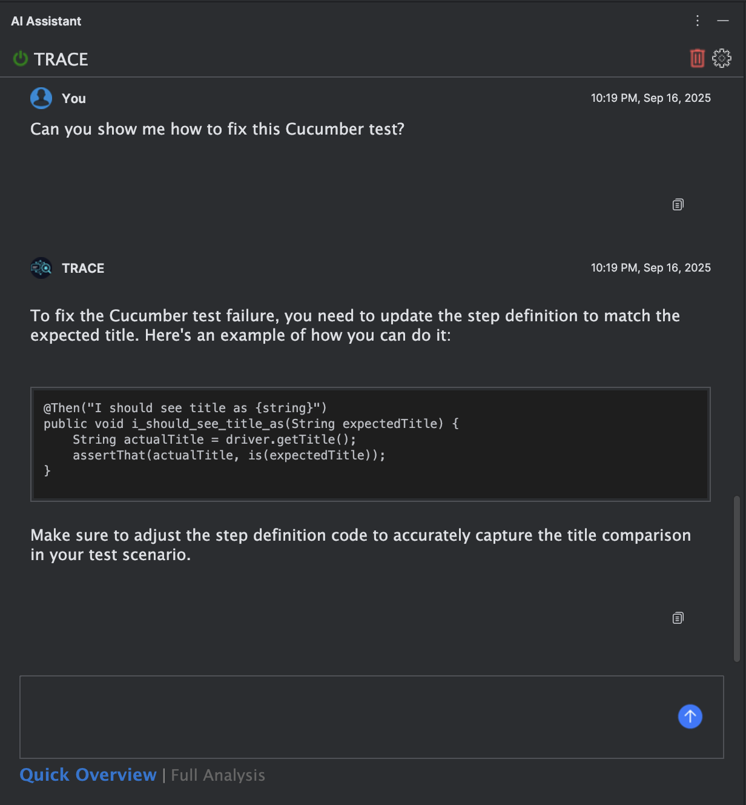
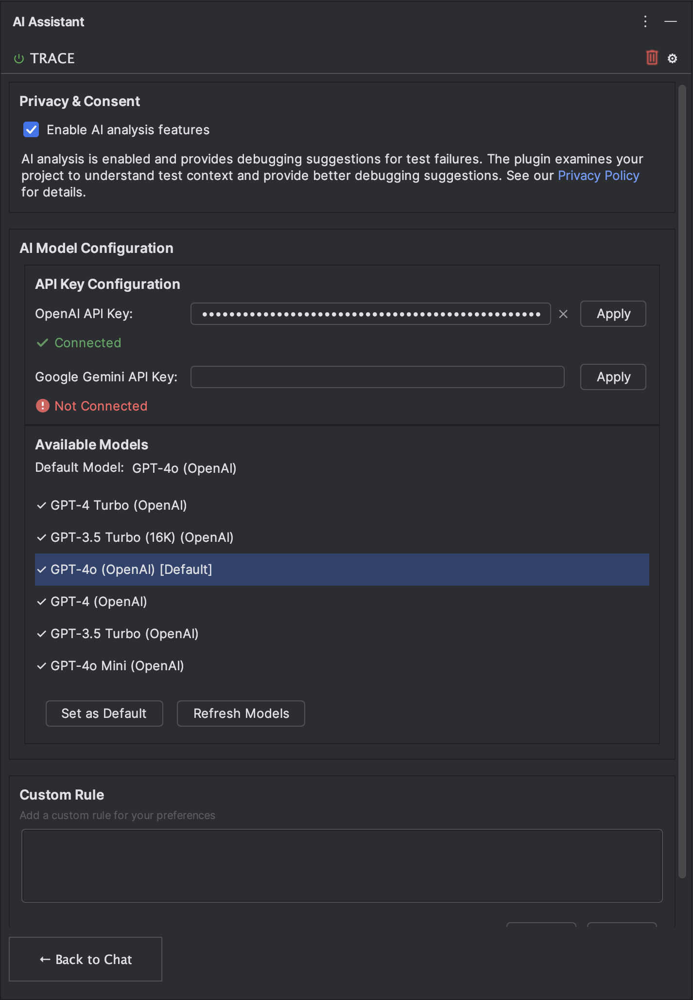
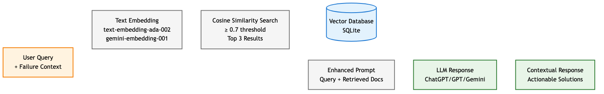

# TRACE - AI-Powered Test Result Analysis and Content Extraction

TRACE is an IntelliJ IDEA plugin that automatically analyzes test failures using AI to help developers and QA engineers quickly identify and resolve test issues.

## Get Started

[](https://plugins.jetbrains.com/plugin/28481-trace)

## Features

- **Automatic Failure Detection**: Automatically captures test failures when they occur
- **Smart Context Extraction**: Extracts relevant code, scenarios, and error details
- **AI-Powered Analysis**: Uses AI to analyze failures and suggest solutions
- **Interactive Chat**: Ask follow-up questions about test failures
- **Secure Setup**: API keys stored safely using IntelliJ's built-in security


## Screenshots

### Test Failure Capture


*Automatic detection and capture of test failures*


### Chat with AI


*Interactive chat interface for follow-up questions*


### Settings Configuration


*Configure AI services, manage API keys, and add custom analysis rules*


### Demo Video
[](https://www.youtube.com/watch?v=IFOzMl-r0Z4)

*Complete TRACE demo showing test failure detection and AI analysis*

## Architecture

### RAG (Retrieval-Augmented Generation) System


*How TRACE uses vector similarity search to retrieve relevant context for AI analysis*

## Requirements

- IntelliJ IDEA 2025.2 or later
- OpenAI API key or Google Gemini API key (Recommended for AI analysis)
- Java 11 or later (for development)

## Installation

1. Download the plugin from the [JetBrains Marketplace](https://plugins.jetbrains.com/plugin/28481-trace) or build from source
2. Install the plugin through IntelliJ IDEA: `File > Settings > Plugins > Install Plugin from Disk`
3. Restart IntelliJ IDEA

## Usage

### Initial Setup

1. Open IntelliJ IDEA and navigate to the TRACE panel
2. (Recommended) Enter your OpenAI or Google Gemini API key for AI analysis
3. Click "Apply" to verify your configuration
4. Select your preferred AI model


### Running Tests

1. Execute your Cucumber tests using IntelliJ's test runner
2. When a test fails, TRACE automatically:
   - Captures the failure information
   - Extracts the stack trace and failed step
   - Identifies the corresponding step definition
   - Retrieves the Gherkin scenario
   - (If configured) Sends context to your configured AI service for analysis
3. View the extracted context and (if available) AI analysis in the TRACE tool window (right panel)
4. (If AI is configured) Ask follow-up questions using the chat interface

### Tool Window

The TRACE tool window provides:
- **Smart Context Packaging**: Consolidates step definitions, scenarios, and stack traces into a well-formatted prompt, ensuring AI delivers precise and relevant results.
- **Failure Analysis** (If AI configured): AI-generated insights about the test failure
- **Chat Interface** (If AI configured): Interactive Q&A about the failure

## Security

### API Key Storage

- API keys are stored securely using IntelliJ's PasswordSafe encryption
- Keys are never stored in plain text or configuration files
- Keys are only transmitted over HTTPS to AI service providers

### Network Usage

- TRACE only sends test failure context to your configured AI service
- No personal data or source code is transmitted beyond the failure context
- All communications use secure HTTPS connections
- You control which AI service to use (OpenAI or Google Gemini)

### Data Privacy

- Test failure information is only sent to your chosen AI service
- No data is stored on external servers beyond the AI service
- See our [Privacy Policy](https://alexibasitas.github.io/TRACE/PRIVACY.html) for detailed information

## Development

### Building from Source

```bash
git clone https://github.com/alexibasitas/trace.git
cd trace
./gradlew buildPlugin
```

### Running in Development

```bash
./gradlew runIde
```

### Testing

```bash
./gradlew test
```

## Configuration

### AI Settings (Recommended)

Access plugin settings by clicking the settings icon in the upper right hand corner of the TRACE panel.

- **API Key**: Your OpenAI or Google Gemini API key
- **Model Selection**: Choose between different AI models
- **Custom Rules**: Add your own custom rules

### Supported AI Services

- OpenAI
- Google Gemini

## Troubleshooting

### Common Issues

1. **Plugin not detecting failures**: Ensure you're running Cucumber tests through IntelliJ's test runner
2. **API key errors**: Verify your API key is correct and has sufficient credits
3. **No analysis displayed**: Check that your AI service is accessible and responding

### Getting Help

- Check the [GitHub Issues](https://github.com/alexibasitas/trace/issues) for known problems
- Review the [documentation](docs/) for detailed guides
- Submit issues with test failure logs for debugging

## License

This project is licensed under the MIT License - see the [LICENSE](LICENSE) file for details.

## Links

- [GitHub Repository](https://github.com/alexibasitas/trace)
- [JetBrains Marketplace](https://plugins.jetbrains.com/plugin/trace)
- [Privacy Policy](https://alexibasitas.github.io/TRACE/PRIVACY.html)
- [Documentation](docs/)

## Support

For support, feature requests, or bug reports, please visit our [GitHub repository](https://github.com/alexibasitas/trace) or open an issue.